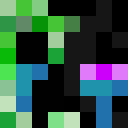

# AdvancedMobGriefing

**Selective mob griefing control for Minecraft servers.**  
Disable block destruction for specific mobs without affecting others — an alternative to the global `mobGriefing false` gamerule.

[]([https://modrinth.com/plugin/](https://modrinth.com/plugin/advancedmobgriefing))
[](https://papermc.io/)

---

## 📖 Background

**AdvancedMobGriefing** was originally developed for a private Minecraft server with one specific goal: to selectively disable griefing for certain mobs — rather than all mobs, as the built-in `gamerule mobGriefing false` does.

Although the plugin was initially created for personal use, it was later released to the public to benefit a wider audience.

Unlike many other solutions, **AdvancedMobGriefing** does not cancel explosion events entirely. Instead, it clears the list of blocks affected by an explosion. This preserves visual and audio effects (particles and sounds), and also retains damage dealt to players and entities, providing the same functional result as `mobGriefing false`, while maintaining a more immersive gameplay experience.

---

## 📌 What It Does

Minecraft’s built-in gamerule `mobGriefing false` disables **all** mob-related block changes.  
But what if you only want to stop creepers from blowing up your builds — without breaking Enderman behavior?

**AdvancedMobGriefing** lets you control griefing **per mob type**, giving you precise control over gameplay without sacrificing vanilla behavior.

✅ Prevent creeper explosions  
✅ Disable fireball destruction from ghasts  
✅ Stop Endermen from picking up blocks  
✅ Keep explosion sounds and particles intact  
✅ Preserve damage to players and mobs — only blocks are protected

---

## ✅ Supported Platforms

- **Minecraft Java Edition:** `1.20.4`
- **Server Types:** [Paper](https://papermc.io/), [Spigot](https://www.spigotmc.org/)
- **Java:** 21 or newer

> [!WARNING]
> The plugin may work on newer versions, but they have not been officially tested.

---

## ⚙️ How to Use (for Server Admins)

Once installed, operators can use the following command in-game or from the console:

```
/mobgriefing (creeper|fireball|enderman) (true|false)
```

### 🔍 Example

```
/mobgriefing creeper false
```

This disables block destruction from creepers.

### Supported Entity Types

- `creeper`  
- `fireball` *(includes ghast fireballs and large fireballs)*  
- `enderman`

> [!NOTE]
> Disabling `fireball` affects **all** large fireballs, including those spawned by commands or plugins.

---

## 🛠 Configuration

A configuration file is created after first server startup:

```yaml
can-grief:
  creeper: true
  fireball: true
  enderman: true
```

📂 File path:  
`/plugins/AdvancedMobGriefing/config.yml`

You can manually edit these values and reload the server to apply changes.

---

## 🔐 Permissions

| Node                 | Description                          | Default |
|----------------------|--------------------------------------|---------|
| `amg.mobgriefing`    | Allows use of the `/mobgriefing` command | OP-only  |

---

## 🧪 Installation

1. Download the latest `.jar` file from [Modrinth]([https://modrinth.com/plugin/](https://modrinth.com/plugin/advancedmobgriefing/versions)) or the [Releases page](https://github.com/ewylson/AdvancedMobGriefing/releases).
2. Place it in your server’s `plugins` folder.
3. Start or restart the server.
4. Configure via command or `config.yml`.

---

## 👨‍💻 For Developers

This project uses **Maven** and requires **Java 21+**.

To include the plugin or build it locally, use the following configuration in your `pom.xml`:

```xml
<repositories>
    <repository>
        <id>spigot-repo</id>
        <url>https://hub.spigotmc.org/nexus/content/repositories/snapshots/</url>
    </repository>
</repositories>

<dependencies>
    <dependency>
        <groupId>org.spigotmc</groupId>
        <artifactId>spigot-api</artifactId>
        <version>1.20.4-R0.1-SNAPSHOT</version>
        <scope>provided</scope>
    </dependency>
</dependencies>
```

---

## 📄 License

This project is licensed under the [MIT License](https://github.com/ewylson/AdvancedMobGriefing/blob/main/LICENSE).  
You are free to use, modify, and distribute it under the terms of that license.

---

## 💬 Get Involved

Have a question, idea, or just want to share feedback?  
Join the conversation in the [Discussions section](https://github.com/ewylson/AdvancedMobGriefing/discussions) or [open an issue](https://github.com/ewylson/AdvancedMobGriefing/issues) if you've found a bug or want to suggest a feature.
